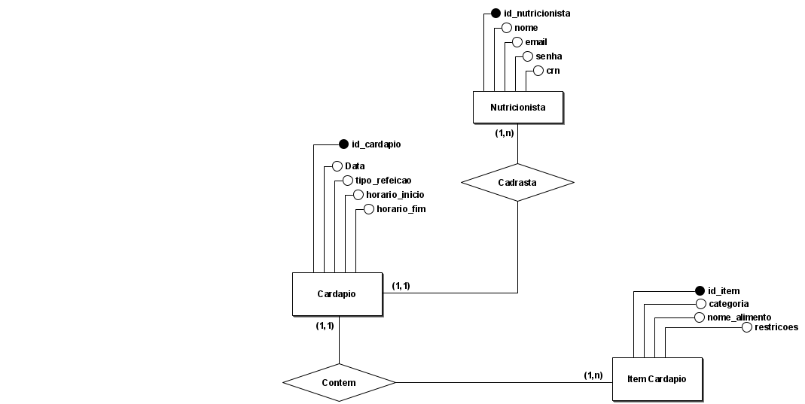
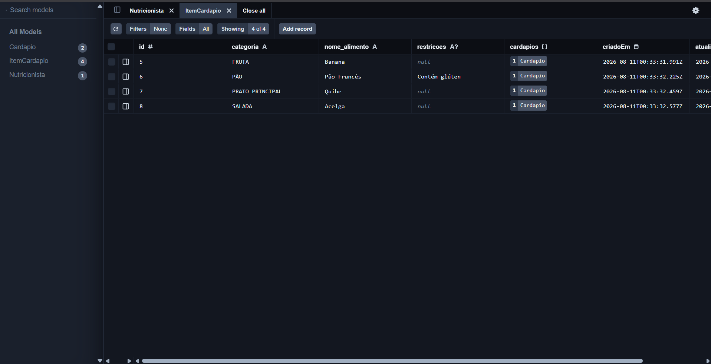

# Tralaleros Tun Tun Sahur - 3° Informática A

## Integrantes

- Amilton Pôrto dos Santos Júnior — [GitHub](https://github.com/amilton-apsj)
- Felipe Neres Silva — [GitHub](https://github.com/fns9-del)
- Marx Hugo Alves Rocha — [GitHub](https://github.com/mhar-Marx)
- Tharcísio Wilker Machado Fernandes — [GitHub](https://github.com/tharcisiowilker)
- Vitor Eduardo Batista Bagetti Ramalho — [GitHub](https://github.com/vebbr-lgtm)

---

# Cardápio Escolar

## 1. Descrição do Domínio

### Tema do sistema

O sistema tem como tema o **Cardápio Escolar**, uma aplicação voltada para a divulgação e o gerenciamento das refeições oferecidas pela escola aos alunos.

### Usuários

O sistema é utilizado por dois perfis principais:

- **Funcionários da escola** (equipe de cozinha/nutrição e administração), responsáveis por cadastrar e atualizar o cardápio semanal.
- **Alunos**, que consultam o cardápio para saber qual será o almoço servido em cada dia.

### Problema que o sistema resolve

Atualmente, os alunos não têm acesso prévio às informações sobre o almoço oferecido pela escola, o que leva muitos a pegarem porções de alimentos que não pretendem consumir simplesmente por desconhecerem o cardápio do dia. Essa falta de comunicação resulta em desperdício de comida, já que os alunos frequentemente descartam pratos que não são do seu agrado.

O sistema busca resolver esse problema disponibilizando o cardápio escolar de forma acessível e antecipada, permitindo que os alunos saibam com antecedência o que será servido e tomem decisões mais conscientes, reduzindo o desperdício de alimentos na escola.

## 2. Modelo Conceitual

### 2.1 Descrição das Entidades

**Nutricionista**
Representa os funcionários autorizados a cadastrar e atualizar as refeições oferecidas. Atributos:

- `id_nutricionista` — identificador único no sistema
- `nome` — identificação do responsável no painel administrativo
- `crn` — número do Conselho Regional de Nutricionistas, que valida o profissional
- `email` e `senha` — necessários para login e segurança das alterações

**Cardápio**
Representa a oferta de uma refeição específica em um determinado dia, exibida no calendário do sistema. Atributos:

- `id_cardapio` — identificador único
- `data` — organiza a exibição no calendário
- `tipo_refeicao` — diferencia Café da Manhã e Almoço
- `horario_inicio` e `horario_fim` — informam alunos e funcionários sobre o período de funcionamento do refeitório naquela refeição

**Item_Cardápio**
Representa os alimentos individuais que compõem um cardápio. Atributos:

- `id_item` — identificador único
- `categoria` — agrupa visualmente os itens (ex: "Salada", "Prato Principal", "Fruta")
- `nome_alimento` — descrição do prato (ex: "Mingau de Coco")
- `restricoes` — informação de saúde relevante (ex: "Contém Lactose", "Vegano", "Contém Glúten")

### 2.2 Relacionamentos e Cardinalidades

**Nutricionista → Cardápio (1:N)**
Um Nutricionista pode cadastrar e gerenciar vários Cardápios ao longo do tempo. Cada Cardápio específico (ex: Almoço do dia 10/08), no entanto, é registrado por um único Nutricionista responsável.

**Cardápio ↔ Item_Cardápio (N:N)**
Um Cardápio é composto por vários Itens de Cardápio (ex: uma refeição tem arroz, feijão, carne e salada). Ao mesmo tempo, um mesmo Item de Cardápio (ex: "Banana") pode estar presente em vários Cardápios de dias e semanas diferentes. Por isso, a relação é de muitos-para-muitos.

## 3. Modelo Lógico

### Diagrama Mermaid do Banco de Dados

mermaid
erDiagram
    Nutricionista ||--o{ Cardapio : "gerencia"
    Cardapio }|--|{ ItemCardapio : "possui"

    Nutricionista {
        Int id PK
        String nome
        String crn
        String email
        String senhaHash
        DateTime criadoEm
        DateTime atualizadoEm
    }

    Cardapio {
        Int id PK
        DateTime data
        String tipo_refeicao
        String horario_inicio
        String horario_fim
        Int nutricionistaId FK
        DateTime criadoEm
        DateTime atualizadoEm
    }

    ItemCardapio {
        Int id PK
        String categoria
        String nome_alimento
        String restricoes "Opcional"
        DateTime criadoEm
        DateTime atualizadoEm
    }

## 4. Modelo Físico — Migrations e Seed

## 5. Evidência funcional

